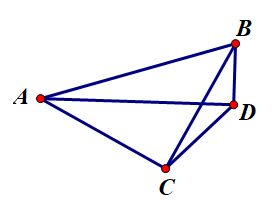
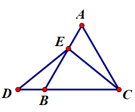
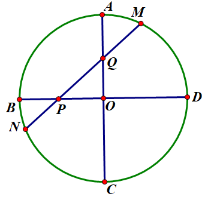

# 选择题
1.已知二次函数 $y=ax^2$ 的图像开口朝上，那么一次函数 $y=ax-1$ 不经过的象限是什么？  
A.第一象限 B.第二象限 C.第三象限 D.第四象限

5.$∠ACB=∠ADB=90°$，$AC=BC$，$BD=2$，$CD=3\sqrt2$，那么$AB$长多少？
  
A.$2\sqrt{17}$ B.$2\sqrt{14}$ C.$8$ D.$9$
# 填空题
# 解答题
17.AE=BD，△ABC$等边,求证 ED=EC  
  

24.如图，$AC$、$BD$为圆 $O$ 的直径，且 $AC\perp BD$，$P$、$Q$分别为半径 $OB$、$OA$ 上的动点，直线 $PQ$ 交圆 $O$ 于点 $M$、$N$。  
  
(1)比较大小 $\cos∠OPQ$ __ $\sin∠OQP$；  
(2)寻找 $MP-NP$ 和 $OP\times \cos ∠OPQ$的关系；  
(3)已知 $∠APO=60°$，$MQ=m\times MP$ $NQ=n\times NP$。  
①求 $n+m$ 的值  
②以$OD$为边向上构造矩形 $ODKS$，已知 $OD$=$1$，$OS$=$\sqrt3-1$，在点Q移动时，不等式 $1+\dfrac{\sqrt{m+n}MP}{MK}-\dfrac{c}{MK}\geq0$ 始终成立，求 $c$ 的最大值。