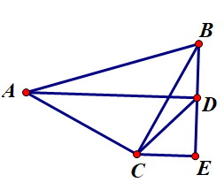
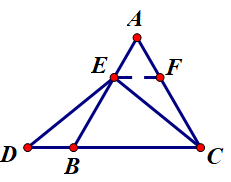
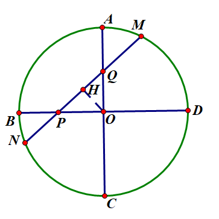
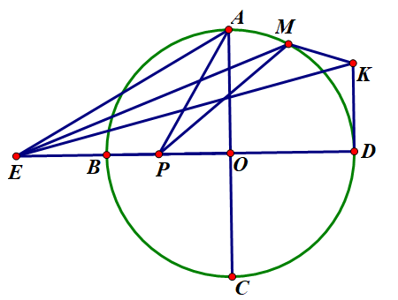

# 选择题
1.已知二次函数 $y=ax^2$ 的图像开口朝上，那么一次函数 $y=ax-1$ 不经过的象限是什么？  
A.第一象限 B.第二象限 C.第三象限 D.第四象限

5.显然四点共圆  
解法1：托勒密定理秒杀！  
设$AC=BC=x$  
$AD\times BC=AB\times CD+AC\times BD$  
$\sqrt{(\sqrt2x)^2-2^2}\times x=(\sqrt2x)\times 3\sqrt2+2x$  
$\sqrt{2x^2-4}=\sqrt2\times 3\sqrt2+2$  
$2x^2-4=64$  
$x=2\sqrt{17}$  
解法2：  
  
作 $CE\perp BD$，$E$ 是垂足  
$∠ABC=∠ADC=45°$  
$\because∠ADB=90°$  
$\therefore \triangle CDE=$ 等腰 $Rt\triangle$  
$\therefore CE=DE=3$  
$\because BD=2$  
$\therefore AB=\sqrt2BC=\sqrt2\times\sqrt{3^2+(3+2)^2}=\sqrt{17}$
# 填空题
# 解答题
17.
  
作 $EF\parallel BC$  
$\therefore \triangle AEF$ 等边  
$\therefore BE=FC$  
$\because AE=BD$  
$\therefore EF=DB$  
$\therefore \triangle DBE\cong \triangle EFC$   
$\therefore DE=EC$   
24.  
(2)  
  
作 $OH\perp MN$  
$MP-NP$  
$=MH+HP-NP$  
$=NH+HP-NP$  
$=2HP$  
$=2OP\times \cos ∠OPQ$  
(3)  
①  
设圆半径为$r$  
$\therefore OP=\sqrt3 r/3$  
$\therefore MP\times NP=BP\times DP=(r-\sqrt3 r/3)(r+\sqrt3 r/3)=r^2-r^2/3=2r^2/3.$  

$\therefore m+n$

$=\dfrac{MQ}{MP}+\dfrac{NQ}{NP}$

$=\dfrac{MQ\times NP+NQ\times MP}{MP\times NP}$

$=\dfrac{(MP-PQ)\times NP+(NP+PQ)\times MP}{2r^2/3}$

$=\dfrac{2MP\times NP+PQ\times (MP-NP)}{2r^2/3}$

$=2+PQ\times 2OP\times cos∠OPQ/(2r^2/3)$

$=2+2OP^2/(2r^2/3)$

$=2+2\times (r^2/3)/(2r^2/3)$

$=3$  
②  
  
$1+\dfrac{\sqrt{m+n}MP}{MK}-\dfrac{c}{MK}\geq0$

$1+\dfrac{\sqrt3MP}{MK}-\dfrac{c}{MK}\geq0$

$MK+\sqrt3MP-c\geq0$

$c\leq MK+\sqrt3MP$

也就是求这个的最大值  
作$∠AEO=30°$  
$\therefore ME=\sqrt3MP$  
$MK+\sqrt3MP=MK+ME\leq EK=2\sqrt2$  
$\therefore c_{max}=2\sqrt2$