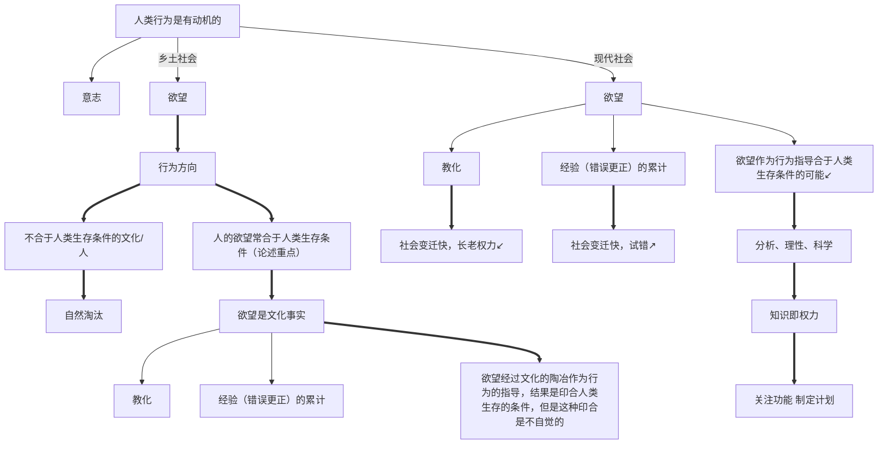

```mermaid
graph
a[人类行为是有动机的]-->b[意志]
a--乡土社会-->c[欲望]
c==>d[行为方向]==>e[不合于人类生存条件的文化/人] & f["人的欲望常合于人类生存条件（论述重点）"]
e==>g[自然淘汰]
f==>h[欲望是文化事实]-->i[教化] & j["经验（错误更正）的累计"]
h==>k["欲望经过文化的陶冶作为行为的指导，结果是印合人类生存的条件，但是这种印合是不自觉的"]
a--现代社会-->A[欲望]-->B[教化] & C["经验（错误更正）的累计"] & F["欲望作为行为指导合于人类生存条件的可能↙️"]
B==>D["社会变迁快，长老权力↙️"]
C==>E["社会变迁快，试错↗️"]
F==>G["分析、理性、科学"]==>H[知识即权力]==>I[关注功能 制定计划]
```